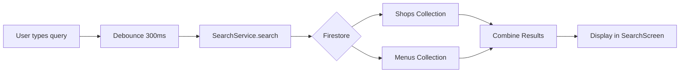

# Implementation Plan - Universal Search

A unified search bar on the home screen to search across shops, menu items, locations, and more.

## Proposed Changes

### [Search Service]
#### [NEW] [search_service.dart](file:///Users/mr.bajrangi/Visual%20Studio%20Code/Projects/Cloud-Kitchen/foody_vrinda_app/lib/services/search_service.dart)
- `Future<List<SearchResult>> search(String query)`: Searches across shops and menu items.
- Combines results from `shops` and `menus` Firestore collections.
- Returns a unified `SearchResult` model with `type` ('shop' or 'menuItem'), `title`, `subtitle`, `imageUrl`, and navigation data.

---

### [Search Screen / Delegate]
#### [NEW] [search_screen.dart](file:///Users/mr.bajrangi/Visual%20Studio%20Code/Projects/Cloud-Kitchen/foody_vrinda_app/lib/screens/search/search_screen.dart)
- A full-screen search experience with:
    - `TextField` with auto-focus for instant typing.
    - Debounced search input (300ms) to avoid excessive queries.
    - Live results display grouped by type (Shops, Menu Items).
    - Empty state for no results.
- On tap, navigates to `MenuScreen` for shop results or directly to the shop with the item highlighted for menu item results.

---

### [Home Screen Integration]
#### [MODIFY] [home_screen.dart](file:///Users/mr.bajrangi/Visual%20Studio%20Code/Projects/Cloud-Kitchen/foody_vrinda_app/lib/screens/home/home_screen.dart)
- Add a search bar or search icon button below the header.
- On tap, navigate to the new `SearchScreen`.
- Optionally, add the search bar below the `_buildHeader` widget above the "Shop Now" section.

---

## Data Flow

## Verification Plan

### Manual Verification
- Search for a shop name and verify it appears in results.
- Search for a menu item name and confirm correct shop association.
- Search for a partial address and confirm matching shops are shown.
- Tap a search result and verify correct navigation.
